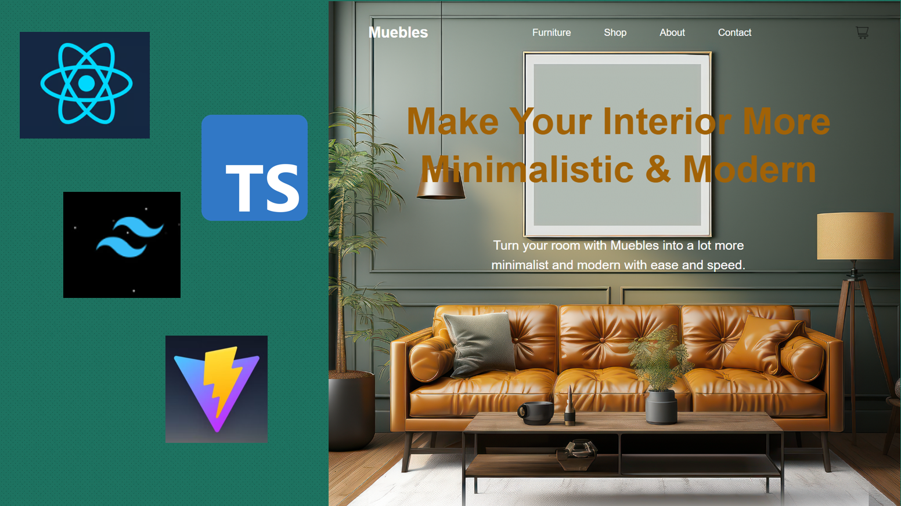

# React + TypeScript + Vite

<div align="center">
  <br />
  
  <h3 align="center">ReactJS - TailwindCSS - Vite - TypeScript</h3>
  <div align="center">

  </div>
</div>


## 📋 <a name="table">Table of Contents</a>

1. 🤖 [Introduction](#introduction)
2. ⚙️ [Tech Stack](#tech-stack)
3. 🔋 [Features](#features)
4. 🤸 [Quick Start](#quick-start)
5. 🕸️ [Snippets](#snippets)
6. 🔗 [Links](#links)
7. 🚀 [Future Upgrade](#future-upgrade)

## 🚨 Learning Point

This repository contains the code corresponding to an in-depth learning from  <a href="https://github.com/MichaelBoitmann/Muebles-ReactJS/tree/main" target="_blank"></a>. 

Like learning this coding exercise by walking thru [Tailwind CSS](https://tailwindcss.com/blog/tailwindcss-v3-4) and [ReactJS](https://react.dev/blog/2023/03/16/introducing-react-dev) online documentation.

## <a name="introduction">🤖 Introduction</a>

Understand Tailwind CSS in applying on ReactJS in two parts by first learning fundamentals, advanced techniques, and theming. Then, build a stunning landing page, applying learned skills to create a visually impressive website.

Thru the process of this website, bugs and unexpected error arises which is good as part of my learning skills set. JS Mastery and Stackoverflow Community definitely serves a big help 

Join JSMastery @ Discord Apps 

## <a name="tech-stack">⚙️ Tech Stack</a>

- Tailwind CSS
- React.JS
- Vite
- Typescript

## <a name="features">🔋 Features</a>

👉 **Maximizing Tailwind CSS**: Discover tips and tricks to make the most out of Tailwind CSS.

👉 **Understanding Tailwind Internals**: Dive into the inner workings of Tailwind, gaining insights into its structure and optimizations.

👉 **Best Practices**: Learn Tailwind's best practices for efficient and maintainable code.

👉 **Theming**: Explore techniques to add different themes to your website using Tailwind CSS.

👉 **JavaScript-like Tasks with Tailwind**: Discover how Tailwind CSS can be used to achieve tasks that typically require JavaScript code

## While creating a simple furniture website a,

👉 **Complex Header Section**: A visually appealing hero section showcasing key elements.

👉 **WHy Choosing Us**: A section highlighting popular Nike products

👉 **About Us Section**: An informative "About Us" section with a unique design.

👉 **Materials Section**: Showcase special offers in an eye-catching manner

👉 **Client Reviews**: A review section for a captivating user experience

👉 **Services**: A services section with Tailwind styling, encouraging user engagement

👉 **Footer**: A comprehensive footer section containing various links

👉 **Mobile Responsive**: The entire website is responsive across various devices, emphasizing Tailwind's mobile-friendly capabilities.

and many more, including code architecture and reusability 

## <a name="quick-start">🤸 Quick Start</a>

Follow these steps to set up the project locally on your machine.

**Prerequisites**

Make sure you have the following installed on your machine:

- [Git](https://git-scm.com/)
- [Node.js](https://nodejs.org/en)
- [npm](https://www.npmjs.com/) (Node Package Manager)
- [Typescript](https://www.typescriptlang.org/)
- [Vite](https://vitejs.dev/)

**Cloning the Repository**

```bash
git clone https://github.com/MichaelBoitmann/Muebles-ReactJS.git
cd dynato
```

**Installation**

Commands to initial setup

```bash
npm create vite@latest
```

```bash
yarn add tailwindcss autoprefixer postcss
```

```bash
npx tailwindcss init -p
```

Install the project dependencies using npm:

```bash
npm install
```


**Running the Project**

```bash
npm start
```

## <a name="vscode-theme">🎨 My VS Code Theme And Extensions :</a> 
- Auto Import
- Glasslt-VSC
- Material Icon theme
- Simple React Snippets
- One Dark Palenight
- Prettier Code Formatter
- Tailwind CSS IntelliSense


Open [http://localhost:5173](http://localhost:5173) in your browser to view the project.

## <a name="snippets">🕸️ Snippets</a>

<details>
<summary><code>.eslintrc.cjs</code></summary>

```javascript
module.exports = {
  root: true,
  env: { browser: true, es2020: true },
  extends: [
    'eslint:recommended',
    'plugin:@typescript-eslint/recommended',
    'plugin:react-hooks/recommended',
  ],
  ignorePatterns: ['dist', '.eslintrc.cjs'],
  parser: '@typescript-eslint/parser',
  plugins: ['react-refresh'],
  rules: {
    'react-refresh/only-export-components': [
      'warn',
      { allowConstantExport: true },
    ],
  },
}

```

</details>

<details>
<summary><code>App.tsx</code></summary>

```javascript
import Header from "./components/Header";
import Why from "./components/Why";
import Products from "./components/Products";
import Experiences from "./components/Experiences";
import Materials from "./components/Materials";
import Reviews from "./components/Reviews";
import Footer from "./components/Footer";

const App = () => {
  return (
    <div className="w-full flex flex-col">
      <Header />
      <Why />
      <Products />
      <Experiences />
      <Materials />
      <Reviews />
      <Footer />
    </div>
  )
}

export default App
```

</details>

<details>
<summary><code>index.css</code></summary>

```css
@tailwind base;
@tailwind components;
@tailwind utilities;

html, body {
  font-family: "Gilroy", sans-serif;
  min-width: 100vw;
  min-height: 100vh;
  overflow-x: hidden;
  background-color: white;
  margin: 0;
  padding: 0;
}

body {
  width: 100%;
  overflow-x: hidden; /* Prevent horizontal scrolling */
}

html {
  max-width: 100%;
  overflow-x: hidden; /* Prevent horizontal scrolling */
}

@font-face {
  font-family: "Gilroy";
  font-style: normal;
  font-weight: 400;
  src: url(".assets/fonts/Gilroy-Regular.ttf")
}

@font-face {
  font-family: "Gilroy";
  font-style: normal;
  font-weight: 400;
  src: url(".assets/fonts/Gilroy-Regular.ttf")
}
@font-face {
  font-family: "Gilroy";
  font-style: normal;
  font-weight: 400;
  src: url(".assets/fonts/Gilroy-Regular.ttf")
}

@font-face {
  font-family: "Gilroy";
  font-style: normal;
  font-weight: 500;
  src: url(".assets/fonts/Gilroy-Medium.ttf")
}

@font-face {
  font-family: "Gilroy";
  font-style: normal;
  font-weight: 600;
  src: url(".assets/fonts/Gilroy-SemiBold.ttf")
}

@font-face {
  font-family: "Gilroy";
  font-style: normal;
  font-weight: 700;
  src: url(".assets/fonts/Gilroy-Bold.ttf")
}

@font-face {
  font-family: "Gilroy";
  font-style: normal;
  font-weight: 800;
  src: url(".assets/fonts/Gilroy-ExtraBold.ttf")
}

@font-face {
  font-family: "Gilroy";
  font-style: normal;
  font-weight: 900;
  src: url(".assets/fonts/Gilroy-Black.ttf")
}
```

</details>

<details>
<summary><code>script.js</code></summary>

```javascript
// To showcase the demo of dark theme. Copy paste :)
<script type="text/javascript">
  document.addEventListener("DOMContentLoaded", () => {
    const toggleDark = document.getElementById('toggleDark')
    toggleDark.addEventListener('click', function() {
      if(document.documentElement.classList.includes('dark')) {
        document.documentElement.classList.remove('dark')
      }
      else {
        document.documentElement.classList.add('dark')
      }
      alert("click!")
    });
  });
</script>
```

</details>

<details>
<summary><code>tailwind.config.js</code></summary>

```javascript
/** @type {import('tailwindcss').Config} */
export default {
  content: ["./index.html","./src/**/*.{js,tx,jsx,tsx}"],
  theme: {
    extend: {},
  },
  plugins: [
    // require('@tailwindcss/typography'),
    // require('@tailwindcss/forms'),
    // require('@tailwindcss/aspect-ratio'),
    // require('@tailwindcss/container-queries'),
  ],
}
```

## <a name="links">🕸️ Links</a>

## <a name="future-upgrade">🕸️ Future Upgrade</a>

1. Routing of each Nav Bar with working page
2. Working Login and Logout
3. Improvement on Responsive Screen sizes
4. Adding Stripe technology to be able to purchase the items
5. Additional items other than shoes
6. Working on some animation on each page
7. Working Bar line when page is on smaller screen


This template provides a minimal setup to get React working in Vite with HMR and some ESLint rules.

Currently, two official plugins are available:

- [@vitejs/plugin-react](https://github.com/vitejs/vite-plugin-react/blob/main/packages/plugin-react/README.md) uses [Babel](https://babeljs.io/) for Fast Refresh
- [@vitejs/plugin-react-swc](https://github.com/vitejs/vite-plugin-react-swc) uses [SWC](https://swc.rs/) for Fast Refresh

## Expanding the ESLint configuration

If you are developing a production application, we recommend updating the configuration to enable type aware lint rules:

- Configure the top-level `parserOptions` property like this:

```js
export default {
  // other rules...
  parserOptions: {
    ecmaVersion: 'latest',
    sourceType: 'module',
    project: ['./tsconfig.json', './tsconfig.node.json'],
    tsconfigRootDir: __dirname,
  },
}
```

- Replace `plugin:@typescript-eslint/recommended` to `plugin:@typescript-eslint/recommended-type-checked` or `plugin:@typescript-eslint/strict-type-checked`
- Optionally add `plugin:@typescript-eslint/stylistic-type-checked`
- Install [eslint-plugin-react](https://github.com/jsx-eslint/eslint-plugin-react) and add `plugin:react/recommended` & `plugin:react/jsx-runtime` to the `extends` list
